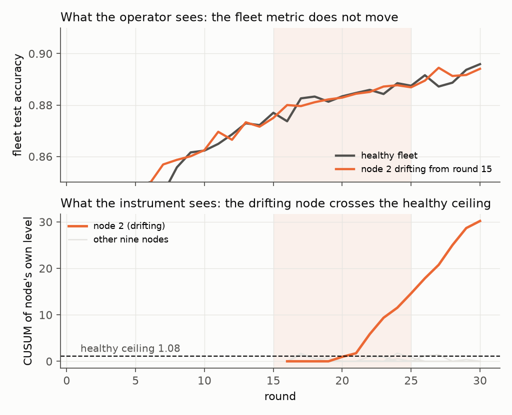
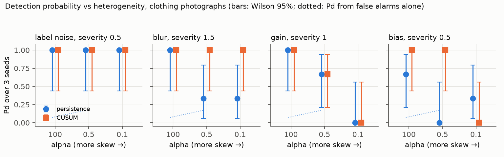
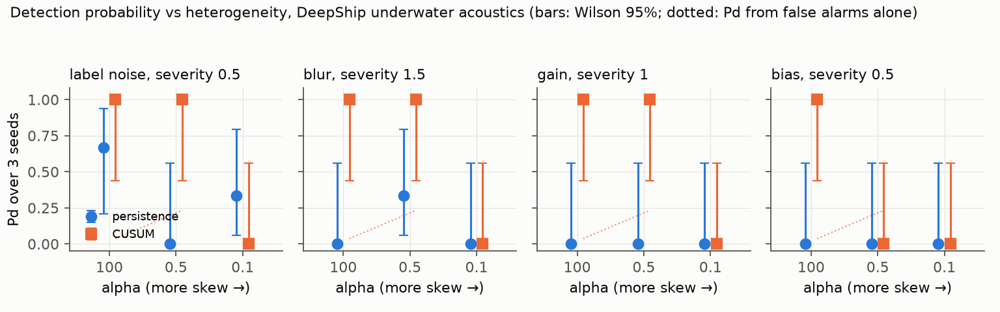
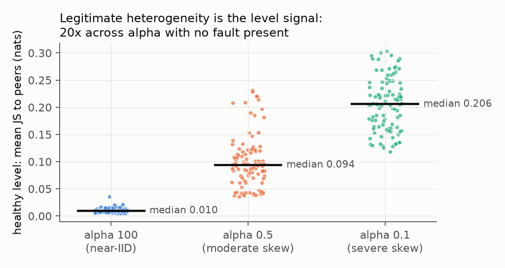
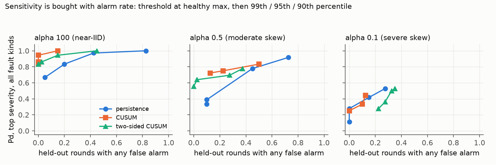
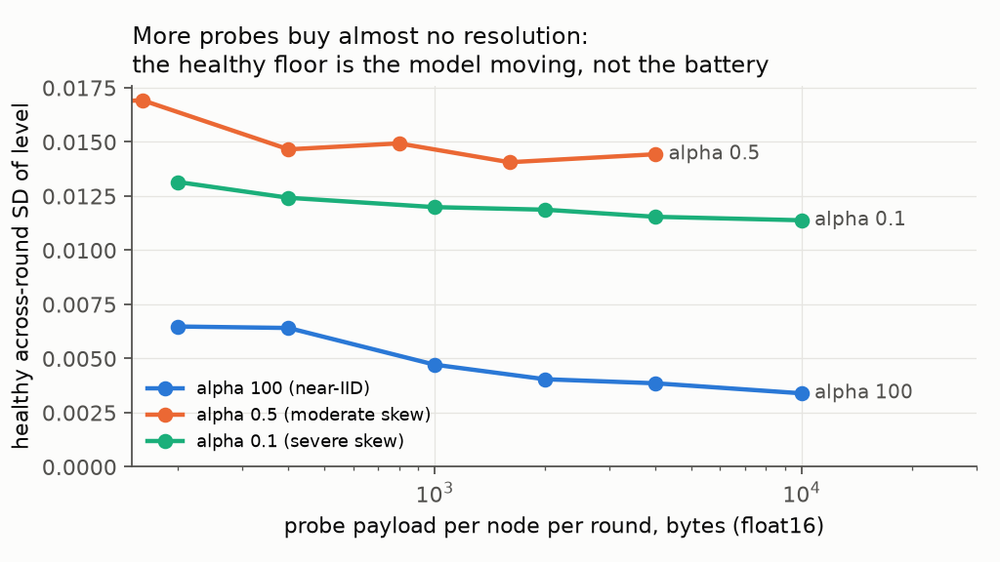

# fedassure

**A measurement harness for federated aggregation integrity.**

In a federated learning system, each node trains locally on its own sensor feeds and returns a
model update for aggregation. Detecting gross faults at a node — dropout, obvious corruption — is
local filtering, and it is largely solved. The failure that survives local filtering is *plausible*
bad data: a sensor drifting slowly inside nominal bounds, a feed that is internally consistent but
miscalibrated. Nothing at that node looks broken. It trains, returns a statistically well-formed
update, and the aggregator has no basis on which to reject it.

That contribution enters the global model, and **the aggregate metric hides it**. Fleet-wide
performance is dominated by healthy nodes, degradation from one drifting platform is gradual, and
nothing in the reported global figure indicates which node is responsible — or that any node is.
The system reports a number that no longer estimates what the model will do, and reports it
confidently.

This repository measures how well that condition can be detected, and states honestly where it
cannot be.



*One slow drift, one node, one seed. Top: what the operator watches. The fleet accuracy with node 2 drifting from round 15 is indistinguishable from the healthy fleet. Bottom: what the instrument watches. The drifting node's cumulative divergence from its own baseline crosses the healthy ceiling five rounds after onset. The grid below turns this single trace into detection probabilities.*

## For evaluators — two minutes

**What it is.** A measurement harness, not a product: it simulates a federation of ten nodes,
gives every node a fixed probe battery, injects a known fault into one node's feed, and reports
whether and when the divergence statistics flag it, with false alarms counted on healthy runs
the thresholds never saw. Pure PyTorch, no federated-learning framework, bitwise reproducible
from seeds, runs on a laptop CPU, ships as a container (`Dockerfile`).

**What it shows so far** (details, intervals and limits in the stage sections below):

- On clothing photographs, the aggregate accuracy an operator watches hid every one of
  ninety injected faults. On real hydrophone recordings it is too noisy to inform either way.
- Label corruption at 30% or more is detected and localised at every heterogeneity level,
  three to four rounds after onset, in every seed tried.
- Slow input drift under realistic heterogeneity is caught by a cumulative statistic on the
  node's own history, four to seven rounds after onset, and by nothing else.
- The probe payload's useful size is about 1 kB per node per round, 0.12% of the model update.
- The same ordering by heterogeneity appears on real underwater acoustics (DeepShip), carried
  by the cumulative statistic; the peer-persistence statistic does not transfer.
- The same layer runs inside a real Flower federation (gRPC, five client processes): a slow
  drift was flagged on the right node seven rounds after onset, 1,000 bytes per node per round,
  and quarantined from aggregation. One run per condition; see "Integration: the layer inside Flower".
- Where it fails: gain drift; severe heterogeneity, where detection depends on which node is
  faulted; intervals from three seeds.

**Reproduce.** `scripts/reproduce.sh` runs everything in order and prices each step first;
`scripts/score_faults.py` and `scripts/make_figures.py` regenerate every table and figure from
the tracked `results/*.json`. Tests: `python -m pytest -q` (no data download needed).

**Progression.** The build ran in five stages; `CHANGELOG.md` says what each one claimed.
This public repository is a single squashed release (`v0.6.0`); the per-stage tags and the
commit history are kept in a private working repository. Design decisions and the alternatives
rejected are in `docs/`. Provenance of every dataset and method is in `CITATION.md`. Licence: MIT.

## The evidence in five figures

Each figure is generated from the tracked `results/*.json` by `scripts/make_figures.py`, and every
number in it is read from a result file. Three seeds per setting, so a 3-of-3 reads as the
interval [0.44, 1.00]; the bars below are 95% Wilson intervals.

**1. Detection against heterogeneity, clothing photographs.** Label corruption is localised at
every level. Slow blur is caught at every level by the cumulative statistic (CUSUM), and slow
bias under moderate skew; under severe skew bias is missed. Gain drift is the failure case:
detection falls to zero under severe skew.



**2. The same instrument on real underwater recordings (DeepShip, four vessel classes).** The
ordering by heterogeneity carries over through the cumulative statistic. Persistence does not
transfer. Gain is caught here where it failed on images. Under severe skew nothing is caught.



**3. Why no fixed threshold can work.** With no fault present, healthy cross-node divergence
spans about twenty times across heterogeneity levels. Thresholds are therefore set against a
locally measured noise floor, and false alarms are counted on healthy runs the threshold never saw.



**4. Sensitivity is bought with alarm rate.** Each statistic at four thresholds, from the healthy
maximum down to the 90th percentile; detection is over the top severity of every fault kind and
the alarm rate is counted on held-out healthy seeds.



**5. How big the probe payload needs to be.** The healthy temporal floor barely moves from 200
bytes to 10 kB per node per round, because the floor is the model moving between rounds, not
the battery being small. The knee is at about 1 kB, 0.12% of the model update.



## Scope

Held deliberately narrow:

    detector + fault injection + measured operating curves

**Out of scope:** edge appliance integration, a deployment-grade federated framework, orchestration
tooling, or anything resembling a product.

## Approach

The method treats federated aggregation as a **measurement reconciliation problem** rather than an
anomaly detection problem. Instead of asking *"does this node's data look wrong,"* it asks *"does
what this node's model now believes disagree systematically with what every other node's model
believes."*

A small fixed **probe battery** ships with the global model. Each node scores it locally and
returns only the resulting scores. Divergence across nodes localises a degraded platform; drift in
a node's own probe responses over time detects miscalibration when peer comparison is unavailable.

Three properties follow from that design, and each maps to a real constraint:

| Property | Consequence |
|---|---|
| Probe scoring is a forward pass over a small fixed batch | Negligible compute against local training |
| The return payload is a vector of scalars | Independent of model size and local data volume |
| No raw sensor data crosses the interface | The mechanism carries no operational content |

## Build order

| Stage | Module | State |
|---|---|---|
| 1. Clean baseline federation | `data` · `models` · `fedavg` | ✅ **done** |
| 2. Probe batteries and divergence | `probes` · `detect` | ✅ **done** |
| 3. Fault injection with known ground truth | `faults` | ✅ **done** |
| 4. Pd / FAR / time-to-detection curves | `metrics` | ✅ **done** (3 seeds; intervals are wide) |
| 5. Second modality: underwater acoustics | `acoustic` | ✅ **done** (3 seeds) |
| 6. Framework integration: Flower | `integrations/flower` | ✅ **done** (demonstration, one run per condition) |

## Why there is no Flower or Ray

FedAvg (McMahan et al., 2017) is implemented directly in `fedassure/fedavg.py`, about eighty lines.
Flower's simulation backend requires Ray, which adds heavy dependencies and actor-based scheduling
for no measurement benefit.

The output of this harness is a detection probability and a false-alarm rate. Neither is
interpretable unless a configuration re-runs identically, so seeding, client selection, and
aggregation are kept fully under local control. `test_run_is_reproducible_from_seeds` asserts
bitwise-identical parameters across repeated runs, and it is the load-bearing test in the suite.

The detector is framework-agnostic by construction, so Flower can be swapped in later if a
deployment demonstration ever calls for it.

## Reproducibility

Every run is fully determined by a `FedConfig`. Seeds are split by concern so one source of
variation can be swept while others are held fixed:

| Seed | Controls |
|---|---|
| `partition_seed` | which client gets which samples |
| `init_seed` | global model initialisation |
| `train_seed` | batch shuffling and training-time stochasticity |

A fault-injection sweep holds `partition_seed` fixed, so detector behaviour is attributable to the
injected fault rather than to a different data split. Each config carries a `fingerprint()` hash
that names its result file, so a run cannot silently overwrite a different run.

## The central confound

**Legitimate non-IID skew is exactly what a naive integrity detector mistakes for corruption.**

Under a Dirichlet partition (Hsu, Qi & Brown, 2019), a low concentration `alpha` concentrates each
class on few clients. Those clients' models then genuinely disagree with their peers — with no
fault present at all. Characterising the detector across `alpha` is therefore not a robustness
afterthought; it is the experiment. A detector that cannot separate *this node has different data*
from *this node has corrupted data* has measured nothing.

## Baseline results

FashionMNIST, 10 clients, 30 rounds, full participation, SmallCNN (206,922 parameters),
SGD lr=0.01 momentum=0.9, one local epoch per round.

| Arm | alpha | Mean TV from uniform | Client sizes | Final test acc | Tail accuracy SD |
|---|---|---|---|---|---|
| Severe skew | 0.1 | 0.668 | 1,149 – 13,142 | 0.8596 | **0.0104** |
| Moderate skew (default) | 0.5 | 0.457 | 3,032 – 10,231 | 0.8959 | 0.0036 |
| Near-IID control | 100 | 0.043 | 5,781 – 6,287 | 0.9029 | 0.0031 |

*Tail accuracy SD is the round-to-round standard deviation over the final ten rounds.*

89.6% under moderate skew is consistent with the published range for FedAvg on FashionMNIST, and
accuracy falls monotonically with heterogeneity as theory predicts.

### The result that constrains everything downstream

**The noise floor scales with heterogeneity.** Round-to-round variance at `alpha=0.1` is 0.0104,
**3.4x** the near-IID 0.0031. A healthy severe-skew federation is *already* noisier than a
near-IID federation containing a real fault would be.

So a single fixed detection threshold cannot work across the heterogeneity range. Calibrated on
near-IID data it will fire continuously under severe skew; calibrated for severe skew it will miss
faults in homogeneous fleets. **Any threshold must be set against the locally measured noise floor,
not against an absolute constant** — and the false-alarm rate has to be reported per `alpha`, never
as a single number.

This is the central confound, quantified before a detector exists. It is exactly what establishing
the baseline first was for.

## The probe battery

Stage 2 adds the instrument. Design choices and rejected alternatives are recorded in
[`docs/stage2_probe_design.md`](docs/stage2_probe_design.md); the short form:

- **Battery.** 500 images drawn once from the held-out test split, stratified by class and
  ordered round-robin, seeded by `probe_seed`. No node trains on them. Round-robin ordering
  means every prefix of length 10·k is itself an exactly stratified battery, so one run yields
  the statistics at every smaller battery size from the same reports — the bandwidth curve is
  measured, not re-run.
- **Scoring.** Each node scores the battery with its *post-local-training* state, the same
  state it returns for aggregation. `ProbeMonitor` attaches to the `update_hook` seam and
  is proven inert: parameters are bitwise identical with and without it, and the full-scale
  runs reproduce the stage-1 accuracy and loss curves number for number.
- **Payload.** `n_probes × n_classes` scalars per node per round, independent of model size
  and local data volume.

Three statistics per node per round, in `fedassure/detect.py`:

| Statistic | What it is | Why |
|---|---|---|
| **level** | mean Jensen–Shannon divergence from the leave-one-out peer consensus, z-scored within the round against that round's median and MAD | the naive cross-node detector; the threshold is set against the locally measured floor, never a constant |
| **self** | mean JS from the node's own rows one round earlier | the disconnected case; needs no peers |
| **persistence** | whether the change in a node's offset-from-consensus, against its own trailing mean, points the same way across rounds | a legitimately skewed node has a large offset that is *stable*; a moving feed produces an offset that *moves* |

Plus an instrument self-check on the probe pathway itself (battery fingerprint echo, shape,
finiteness, row normalisation, replay detection, scorer determinism), because a degraded
scorer and a degraded feed look identical in naive monitoring.

**Why level alone cannot be the detector.** Under non-IID skew a node genuinely believes
differently from its peers, every round, with no fault present. The level statistic measures
exactly that, so its healthy spread across nodes is the heterogeneity confound in numerical
form. The persistence statistic is the candidate that separates *different* from *changing*.
Whether it does is a stage-4 measurement against stage-3 faults; here only its healthy floor
is characterised.

## Stage 2 results: the healthy divergence floor

Same three arms as the baseline, same seeds, `ProbeMonitor` attached with a 500-probe battery.
Full tables regenerate with `scripts/summarise_probes.py`; the numbers below are the ones
that constrain stage 3 and 4. All statistics are over the final ten rounds.

**Inertness at scale.** All three instrumented runs reproduced the stage-1 accuracy *and*
training-loss curves number for number, and the instrument self-check reported zero issues in
90 client-rounds. Runtime was unchanged (6.4–6.6 min per run).

### The level statistic is the confound in numerical form

| alpha | level median (500 probes) | across-client SD | across-round SD | healthy max abs z | self median |
|---|---|---|---|---|---|
| 0.1 (severe) | **0.206** | 0.048 | 0.011 | 2.0 | 0.012 |
| 0.5 (moderate) | 0.063 | 0.021 | 0.009 | 3.1 | 0.012 |
| 100 (near-IID) | 0.010 | 0.004 | 0.003 | **6.7** | 0.014 |

Three things follow, and the third was not predicted:

1. **Typical cross-node divergence in a healthy federation spans 20x across the heterogeneity
   range** (0.010 to 0.206 nats). Legitimate skew *is* the level signal. Any threshold on the
   raw level is a threshold on alpha.
2. **The across-client spread spans 13x.** Under skew it is flat in battery size — it is real
   heterogeneity, not sampling — and only at near-IID does it fall with more probes.
3. **Within-round robust z is not transferable across alpha either, and it inverts.** The
   healthy maximum |z| is *largest* near-IID (6.7) and smallest under severe skew (2.0),
   because the within-round MAD over ten nodes shrinks to 0.003 near-IID and a node sitting
   0.005 above its peers scores z ≈ 2 every round with spikes to 7. A z-threshold of 3 would
   fire continuously in the *homogeneous* fleet. The "locally measured floor" cannot be one
   round of ten nodes; it must be measured over a window of rounds, per federation.

The **temporal self-divergence is roughly alpha-independent** (0.012–0.014). It is the
better-behaved floor and the natural baseline for the disconnected case.

### Persistence: the healthy floor for the candidate discriminator

| alpha | persistence median | healthy max, 10 probes | healthy max, 50 probes | healthy max, 500 probes |
|---|---|---|---|---|
| 0.1 | 0.41 | 0.82 | 0.77 | 0.71 |
| 0.5 | 0.39 | 0.77 | 0.70 | 0.65 |
| 100 | 0.38 | 0.86 | 0.57 | 0.58 |

Median persistence sits at or below the 1/√5 ≈ 0.45 that zero-mean noise predicts over a
five-round span, at every alpha: **a healthy node's offset from consensus does not move in a
consistent direction**, whether or not it is legitimately skewed. That is the property the
design leans on. The healthy *maximum* is the number a fault has to beat, and it is the one
statistic here that tightens with battery size.

### Bandwidth, measured

SmallCNN update: 827,688 bytes per node per round. Probe payload at float16:

| probes | bytes | % of model update | across-round SD, alpha 0.5 | across-round SD, alpha 100 |
|---|---|---|---|---|
| 10 | 200 | 0.02 | 0.0095 | 0.0065 |
| 50 | 1,000 | 0.12 | 0.0101 | 0.0047 |
| 500 | 10,000 | 1.21 | 0.0085 | 0.0034 |

**The temporal floor of the level statistic barely moves from 10 probes to 500.** Probe-sampling
noise would fall sevenfold; it falls 10% under skew and 2x near-IID. Checked by a different
path: disjoint 100-probe sub-batteries of the same run have round-to-round correlation
0.86–0.93, and averaging two of them leaves the spread unchanged (ratio 0.95–0.99 against
0.71 for independent noise). The round-to-round wobble is the *model moving*, common to
every probe, not the battery being small. For the level statistic the knee is at or below
50 probes, one kilobyte, 0.12% of the update. Battery size buys resolution only on the
persistence ceiling (table above) and on the near-IID sampling term.

**Encoding.** float16 shifts the level statistic by under 1e-5, nothing. uint8 shifts it by
about 1e-3, which is a third of the near-IID across-round floor: cheap under skew, not free
in a homogeneous fleet. float16 is the payload assumption throughout.

### What this stage does not say

No fault exists, so no detection probability exists. Everything above is the false-alarm side
of the operating curve. The stage-3 faults must be characterised against *these* floors, per
alpha, and the level statistic's per-alpha behaviour above is the reason stage 4 cannot report
one false-alarm rate.

## Stage 3 and 4: faults, and the first operating measurements

Design record: [`docs/stage3_fault_design.md`](docs/stage3_fault_design.md). Faults are
transforms on one node's shard through a second seam on the training loop, with a linear ramp
from an onset round; before onset, or at severity zero, a run is bitwise identical to the
healthy run (tested). Four kinds: additive `bias`, `gain`, `blur`, `label_noise`.

Thresholds are the healthy maximum after a ten-round burn-in on train seed 0, per alpha, per
statistic. They never see a fault. The false-alarm rate is counted on **held-out** healthy
seeds, because on the calibration seed it is zero by construction. All fault runs so far:
node 2, onset round 15, ramp 10 rounds, train seed 0. `scripts/score_faults.py` regenerates
every table below.

### The same slow fault across heterogeneity

Additive bias ramping to 0.5 SD over ten rounds. "Fleet acc" is the aggregate metric an
operator would see; "ttd" is rounds from onset to first flag on the faulted node.

| alpha | fleet acc healthy → faulted | level | within-round z | persistence | CUSUM | false localisations |
|---|---|---|---|---|---|---|
| 100 (near-IID) | 0.8987 → 0.8980 | ttd 9 | ttd 7 | ttd 8 | ttd 11 | 0 |
| 0.5 (moderate) | 0.8888 → 0.8879 | miss | miss | miss | **ttd 5** | 0 |
| 0.1 (severe) | 0.8441 → 0.8451 | miss | miss | miss | miss | 1 |

**Detectability of the same fault falls monotonically with heterogeneity**: everything sees
it in a homogeneous fleet, one statistic sees it under moderate skew, nothing sees it under
severe skew. The fleet metric never moved by more than one part in a thousand in any arm.
That is the stage-1 prediction, measured. One confound is stated rather than hidden: node 2
holds 6,105 / 3,711 / 1,149 samples across the three arms, so heterogeneity and node weight
are entangled here. The grid varies the node.

### Fault kinds at alpha 0.5

| fault | severity | fleet acc | persistence | own-history z | CUSUM | notes |
|---|---|---|---|---|---|---|
| bias step | 0.5 | 0.8877 | miss | **ttd 0** | **ttd 0** | step caught at onset by both own-history statistics |
| bias ramp | 0.5 | 0.8879 | miss | miss | ttd 5 | ramp caught at 30% of final severity |
| bias ramp | 1.0 | 0.8880 | miss | miss | ttd 2 | |
| bias ramp | 2.0 | 0.8882 | miss | miss | ttd 0 | |
| label-noise ramp | 0.3 | 0.8881 | **ttd 4** | miss | ttd 4 (2 false loc.) | persistence localises cleanly; CUSUM also flags two healthy nodes |
| blur ramp | σ = 1.0 px | 0.8881 | miss | miss | ttd 9 | caught only once the ramp completes |
| gain ramp | 0.5 | 0.8892 | miss | miss | miss | the node's divergence *fell* (0.028 → 0.018); a one-sided CUSUM cannot see a decrease, and the node was barely hurt (probe acc 0.873 → 0.869) |

**Additive bias is a fault the model absorbs.** Its direct signature saturates at about
0.02 nats from 0.5 SD upward: a convolutional net with learnable bias terms cancels a constant
offset within one local epoch, so the severity ladder is flat, the node's own probe accuracy
drops only 2–4 points, and its confidence *rises*. It stays in the study as the weak case.

### False-alarm rate on held-out healthy seeds

| alpha | held-out node-rounds | persistence | own-history z | CUSUM |
|---|---|---|---|---|
| 0.1 | 200 | 0.0% | 0.0% | 0.0% |
| 0.5 | 400 | 1.3% (any node: 10% of rounds) | 0.3% | 1.5% (any node: 12.5% of rounds) |
| 100 | 200 | 0.5% | 0.0% | 0.0% |

The CUSUM threshold near-IID is 19.7 against 1.1 at alpha 0.5, because one healthy near-IID
node's level climbed 36% over the tail in a fleet whose reference spread is 0.003 nats. That
is why CUSUM is the *slowest* statistic near-IID (ttd 11) while being the only one that works
at moderate skew. Per-alpha thresholds are not a convenience; they are the operating point.

### Stage 4: the grid

99 runs (`scripts/run_grid.py`, 10.0 h on the M4 Pro): three alphas × three train seeds, each
with a healthy run and ten faults on node 2 — label noise 0.1/0.3/0.5, blur 0.5/1.0/1.5 px,
gain 0.25/0.5/1.0, bias 0.5 — all ramped over ten rounds from round 15. Thresholds from seed 0
per alpha; false-alarm rate on seeds 1 and 2; detection probability as the fraction of the
three seeds detected, with a Wilson 95% interval. Every number below is in the output of
`scripts/score_faults.py`; the tables here are the summary.

**The fleet metric hid every one of the 90 faults.** The largest tail-accuracy movement in
any arm was 0.0035 (label noise 0.5, near-IID). Everything below was invisible to the number
an operator currently watches.

**Detection probability, top severity of each fault kind.** "Chance" is the Pd the held-out
false-alarm rate alone would produce over the fifteen post-onset rounds. 3 of 3 reads as
Pd 1.00 with interval [0.44, 1.00]; 0 of 3 as [0.00, 0.56].

| fault | alpha 100 (near-IID) | alpha 0.5 (moderate) | alpha 0.1 (severe) |
|---|---|---|---|
| label noise 0.5 | persistence **1.00** (ttd 3), CUSUM 1.00 | persistence **1.00** (ttd 3), CUSUM 1.00 | persistence **1.00** (ttd 4), CUSUM 1.00 |
| blur 1.5 px | persistence 1.00, CUSUM 1.00 | CUSUM **1.00** (ttd 4), persistence 0.33 | CUSUM **1.00** (ttd 5), persistence 0.33 |
| gain 1.0 | persistence 1.00, CUSUM 1.00 | 0.67 / 0.67 (chance 0.17 / 0.20) | **0.00** everything |
| bias 0.5 | CUSUM 1.00, persistence 0.67 | CUSUM **1.00** (ttd 5), persistence 0.00 | 0.00 (persistence 0.33) |

Three statements, each with its limit:

1. **Label corruption is detected and localised at every heterogeneity level**, 3 of 3 seeds
   at 30% and 50% corruption, by the persistence statistic, three to four rounds after onset,
   with at most two healthy nodes mis-flagged per run. This is the stage-2 design working as
   designed. Limit: at 10% corruption it drops to 0–0.33 under skew.
2. **Slow input drift (blur, bias) is detected under moderate and severe skew only by CUSUM**,
   3 of 3 seeds at blur ≥ 1 px and every bias level, four to seven rounds after onset, where
   persistence and the cross-node statistics miss. Limit: CUSUM's false localisation on
   *label* faults is severe (8–29 healthy nodes flagged per run) because corrupted labels move
   every node's level once aggregated. CUSUM detects; persistence localises.
3. **Gain is the failure case.** Under severe skew nothing sees it at any severity; under
   moderate skew the best Pd is 0.67 with chance at 0.17–0.20 and three seeds, which is not a
   result. The faulted node moves *toward* the fleet, and a one-sided accumulator cannot see a
   decrease (design record s.3). Two-sided CUSUM is the named next step, decided from healthy
   runs before any further fault run.

**False-alarm rate, held out (seeds 1 and 2, 400 node-rounds per alpha):** persistence 0.0% /
1.3% / 0.5% and CUSUM 0.0% / 1.5% / 0.0% node-round at alpha 0.1 / 0.5 / 100. At alpha 0.5
CUSUM's per-round any-node alarm rate is 12.5%: one false alarm somewhere in the fleet every
eight rounds at the healthy-max threshold. That is the price of its sensitivity to slow drift,
and it is a curve, not a fact: raising the threshold trades it against time to detection.

**What three seeds can and cannot say.** A 3-of-3 detection has a lower interval bound of
0.44. The claims above are therefore "detected in every seed tried," not "Pd ≈ 1". Doubling
the seeds tightens the bound to 0.61; it is a second overnight run.

**The node confound, resolved.** `run_grid.py --nodes` (72 more runs, 8.6 h) repeats the
mid-severity faults on nodes 5 and 9, which are different-sized nodes with different class
mixes. At near-IID and moderate heterogeneity the result does not depend on the node: label
noise 0.3 is caught by persistence and CUSUM on all three nodes, 3 of 3 seeds each, and blur
1.0 by CUSUM on all three at alpha 0.5. At severe heterogeneity it does: label noise 0.3 is
caught on node 2 (1,149 samples, the smallest) and missed on nodes 5 and 9 (about 5,300
each), by every statistic. So the honest reading of the severe-skew column is not "the
instrument fails there" but "there, detection depends on the faulted node's data mix," and a
fleet-wide detection probability is not a single number.

### Two things decided from existing results, no new runs

**Two-sided CUSUM recovers the gain case at moderate skew, and costs elsewhere.** Judged on
the healthy runs first: its ceiling is 22.5 / 17.0 / 19.7 at alpha 0.1 / 0.5 / 100, against
0.7 / 1.1 / 19.7 one-sided, because healthy nodes wander *down* as readily as up and the
two-sided sum accumulates both. Then scored on the existing gain runs:

| gain, alpha 0.5 | one-sided CUSUM | two-sided CUSUM |
|---|---|---|
| severity 0.25 | 0.00 | 0.67 |
| severity 0.5 | 0.00 (chance 0.20) | **1.00** (chance 0.00, 0 false localisations, ttd 11) |
| severity 1.0 | 0.67 | 0.00 |

The 0.5 row is a real recovery. The 1.0 row is not monotone and three seeds cannot say why.
Under severe skew the two-sided version reads 1.00 on gain but its held-out false-alarm rate
there gives a chance floor of 0.32, which disqualifies it. And its higher ceiling at alpha 0.5
drops the all-kinds Pd at the healthy-max threshold from 0.92 to 0.67 (sweep below). The
right structure is two separately calibrated one-sided sums, up and down, so that a downward
wander does not raise the bar for upward drift. Named for the next session; not built.

**The threshold sweep: the exchange rate.** Each statistic at four thresholds, healthy maximum
then 99th / 95th / 90th percentile of healthy node-rounds; Pd over the top severity of every
fault kind (12 runs per point); alarm rate on held-out seeds (`figures/operating_curve.png`).

| alpha | statistic | Pd at healthy max (any-node alarm rate) | Pd at 95th pct (alarm rate) | false loc. per run, max → 95th |
|---|---|---|---|---|
| 100 | persistence | 0.92 (5%) | 1.00 (43%) | 0.4 → 8.9 |
| 100 | CUSUM | 1.00 (0%) | 1.00 (0%) | 7.5 → 15.0 |
| 0.5 | persistence | 0.50 (10%) | 0.83 (45%) | 1.8 → 10.7 |
| 0.5 | CUSUM | 0.92 (12.5%) | 1.00 (50%) | 9.0 → 21.9 |
| 0.5 | two-sided CUSUM | 0.67 (0%) | 0.92 (28%) | 0.2 → 5.7 |
| 0.1 | persistence | 0.42 (0%) | 0.75 (15%) | 0.0 → 5.5 |
| 0.1 | CUSUM | 0.50 (0%) | 0.58 (12.5%) | 4.8 → 8.9 |

Read across a row: lowering the threshold buys detection with alarms *and* with mislocalised
healthy nodes, and the second cost grows faster than the first. Read down a column: at the same
alarm rate, detection falls with heterogeneity. The near-IID column is close to free; the
severe-skew column is the honest ceiling of this instrument at thirty rounds and ten nodes.

### Stage 5: the same instrument on underwater acoustics

Every number above is on clothing photographs. **DeepShip** (Irfan et al., 2021) is real
hydrophone recordings of ships in the Strait of Georgia, four vessel classes; the public
portion (63 recordings, about ninety minutes) is turned into 28×28 log-mel images and fed to
the **unchanged** harness — same model, battery, faults, statistics, scorer. Design record and
the reasons for every choice, including why a synthetic sonar set was rejected:
[`docs/stage5_acoustic_design.md`](docs/stage5_acoustic_design.md).

Split is by recording, never by window (window splits leak). 52 training recordings, 11
test; held-out-recording accuracy about 53% on four classes; five local epochs so the model
settles by round 10. The healthy floor is noisier than clothing everywhere (level median
0.094 vs 0.063 at alpha 0.5; persistence 0.47, at the noise expectation).

**The grid: 99 runs, 4.9 h, same protocol, thresholds from acoustic healthy seed 0, false
alarms on acoustic seeds 1 and 2.** Detection probability at the top severity of each kind,
one-sided CUSUM, with the chance floor from the held-out false-alarm rate:

| fault | alpha 100 | alpha 0.5 | alpha 0.1 |
|---|---|---|---|
| label noise 0.5 | **1.00** (chance 0.04, ttd 4) | 1.00 (chance 0.23, ttd 12, 5 false loc.) | 0.00 |
| blur 1.5 | **1.00** (0.04, ttd 4) | 1.00 (0.23, ttd 10, 5 false loc.) | 0.00 |
| gain 1.0 | **1.00** (0.04, ttd 5) | 1.00 (0.23, ttd 12, 4 false loc.) | 0.00 |
| bias 0.5 | **1.00** (0.04, ttd 6) | 0.00 | 0.00 |

Three things transfer and two do not:

- **The ordering by heterogeneity transfers.** Everything at near-IID with a 4% chance floor,
  most things at moderate skew, nothing at severe skew — the stage-4 shape on a second, harder,
  more relevant input. The moderate-skew catches are late (10–12 rounds) and sit against a 23%
  chance floor, because the acoustic healthy runs alarm more (1.8% of node-rounds); they are
  above chance with three seeds, not far above.
- **The cumulative statistic transfers; the peer-persistence statistic does not.** Persistence,
  which localised label corruption cleanly at every alpha on clothing, reads 0.67 at near-IID
  and zero elsewhere here. On a small dataset the model memorises recordings, every node's
  offset from consensus wanders, and the healthy persistence ceiling (0.85–0.90) is above what a
  fault produces. CUSUM's per-node reference absorbs that; a fleet-relative statistic cannot.
- **Gain is detected here** where it was the failure case on clothing, by one-sided CUSUM,
  at near-IID and moderate skew. The direction of a fault's effect on a node's divergence is
  modality-dependent, which is an argument for running both directions (§ two-sided).
- **The fleet metric is not "quietly wrong" here; it is uninformative.** Tail accuracy moved
  by −6 to +7.6 points across the 90 fault runs, in both directions, because eleven test
  recordings make it noisy. The stage-4 sentence "the aggregate hid every fault" is a
  clothing result and is stated as such in the front door.
- **Severe heterogeneity catches nothing** at any severity by any statistic, with thresholds
  at zero false alarms. That is the ceiling of this instrument on this data.

Figure: `figures/pd_by_alpha_acoustic.png`.

### Intermittent contact: the submarine arm

The brief claims tolerance of intermittent connectivity. This arm tests it. Same federation
at alpha 0.5, but nodes 2, 5 and 8 are submarines that report every third round, staggered;
the other seven report every round. A silent boat trains nothing that round and syncs to the
current global model on its next contact (the stale-training case is out of scope; see
`docs/stage3_fault_design.md` s.7). Every temporal statistic runs over a node's own
contacts, and time to detection is counted in contacts. Thresholds come from a healthy run on
the same schedule.

| fault on submarine node 2 | fleet acc | persistence | CUSUM | every-round result for comparison |
|---|---|---|---|---|
| label-noise ramp 0.3 | 0.8909 → 0.8913 | **caught at 5th contact after onset** (round 27), 0 false localisations | miss | persistence ttd 4 |
| bias ramp 0.5 | 0.8909 → 0.8906 | miss | miss | CUSUM ttd 5 |

Two costs of intermittency, measured rather than assumed:

- **Warm-up scales with the contact period.** Persistence needs nine contacts of history, so
  on a three-round schedule it is first defined at round 27. The label-noise catch above is at
  the first contact where the statistic exists at all.
- **A fixed reference epoch starves a boat.** CUSUM's reference is rounds 5–14; a submarine has
  three contacts in it, its reference spread is estimated from three points, and one healthy
  boat's ceiling came out at 26.5 against 1.2 for the ships. Because thresholds are fleet-wide,
  that one boat set the CUSUM threshold for everyone, and the bias ramp that CUSUM caught in
  five rounds on the every-round schedule was missed. The fix is structural and not built:
  thresholds per platform class, and reference epochs defined in contacts rather than rounds.

What survived: the instrument self-check is clean with gaps; the fleet metric never moved; and
the peer-comparison statistic that localises label corruption cleanly on the dense schedule
still localises it on a boat that reports one round in three.

**The two structural fixes, applied and then limited by the data.** Thresholds are now
calibrated per platform class, and CUSUM's reference spread is pooled within a class whenever
any node in it has fewer than five reference contacts (a well-sampled class keeps per-node
spreads, so every every-round result above is unchanged to the last digit). With those in
place the boat's own-history statistics do flag both submarine faults — but the submarine
thresholds are maxima over **3 to 20 healthy values** (three boats, a 30-round run), against
105–150 for ships, and a ceiling taken over fifteen numbers is not a ceiling. The scorer
prints that count next to every threshold. The honest statement is: the structure is right,
and it needs about ten times the healthy boat-rounds before a submarine detection is a claim.

### Figures

`scripts/make_figures.py` renders one figure per claim into `figures/` from the result files
and writes `figures/index.html` with the sentence each supports. No dashboard: the audience
reads a brief.

### What this does and does not claim

It claims, with 3 seeds and the intervals that implies: label corruption at 30% or more is
detected and localised at every heterogeneity level three to four rounds after onset; slow
blur and bias drift are detected under skew by CUSUM alone, four to seven rounds after onset;
gain drift is not reliably detected; the fleet accuracy metric hid all ninety faults; false
alarms are 0–1.5% of node-rounds at the healthy-maximum threshold. It does not claim a
detection probability tighter than the intervals shown, anything about node weight, anything
about a submarine beyond one seed, or anything about sonar.

## Integration: the layer inside Flower

The harness above is framework-free on purpose, so its numbers reproduce bit for bit. This
section is the other half: evidence that the same battery and detector drop into a standard
federated learning framework without modification.

`fedassure/integrations/flower.py` packages the layer as a Flower strategy (`IntegrityFedAvg`,
a `FedAvg` subclass). It implements the interface the solution brief promises:

- **Probe battery out.** Every node builds the same battery from a shared seed and returns its
  fingerprint; a mismatch is recorded as an instrument fault and not scored.
- **Score vector in.** Each node scores the battery with its post-training model **on the node**
  and returns only the float16 class probabilities, in Flower's `FitRes` metrics. The server
  never runs a probe forward pass and never sees raw data.
- **Quarantine hook.** Once a node is flagged, its update is excluded from aggregation.

The detector is the harness's own `level_series` + `cusum`, same reference epoch. Nothing is
reimplemented.

`scripts/flower_demo.py` runs a real Flower server (gRPC) and five client processes on one host:
a healthy run sets the threshold (CUSUM healthy maximum after the reference epoch), then a run
with blur severity 1.5 on node 2 from round 15, ten-round ramp, 30 rounds, alpha 0.5.

| Run | First flag | Healthy nodes flagged | Payload | Fleet accuracy, faulted vs healthy |
|---|---|---|---|---|
| Detection only | node 2, round 22 (7 after onset) | none | 1,000 B/node/round | −0.41 pts |
| With quarantine | node 2, round 22 (7 after onset); excluded from aggregation from round 22 | none | 1,000 B/node/round | −0.46 pts |

Results: `results/flower_demo_blur_noq.json`, `results/flower_demo_blur_q.json`.

**What this does and does not show.** It shows the interface works end to end inside a real
framework, the payload is what the brief says, and the first flag lands on the right node inside
the harness's 4–7-round window. It is **one run per condition**, a demonstration, not a
detection probability; those remain the harness numbers above. Flower runs are not bitwise
reproducible (multi-process timing changes summation order; the two healthy thresholds were 5.77
and 4.26), which is why measurement stays in the harness. Quarantine did not measurably change
fleet accuracy here because this fault barely moved it in the first place; its value is keeping a
known-bad contributor out of the shared model, not a number this run can show. All processes ran
on one host over loopback; this is integration, not tactical deployment. It uses Flower's
`start_server`/`start_client` compatibility API (deprecated since 1.13 in favour of SuperLink/
SuperNode); porting to that CLI or to NVIDIA FLARE is Phase 2 work. Tests:
`tests/test_flower_integration.py`, including one that pins the known limit (drift toward the
fleet is not flagged by the one-sided statistic).

## Usage

```bash
python3.12 -m venv .venv
.venv/bin/pip install -r requirements.txt          # or requirements-lock.txt for the exact versions used

.venv/bin/python -m pytest -q

.venv/bin/python scripts/run_baseline.py --rounds 30 --clients 10 --alpha 0.5
.venv/bin/python scripts/run_baseline.py --alpha 100 --tag iid       # near-IID control
.venv/bin/python scripts/run_baseline.py --alpha 0.1  --tag severe   # severe skew

.venv/bin/python scripts/run_probes.py --alpha 0.5                    # same arms, monitor attached
.venv/bin/python scripts/run_probes.py --alpha 100 --tag iid
.venv/bin/python scripts/run_probes.py --alpha 0.1 --tag severe
.venv/bin/python scripts/summarise_probes.py                          # cross-arm tables

.venv/bin/python scripts/run_probes.py --alpha 0.5 --kind bias --node 2 --onset 15 --ramp 10 --severity 0.5
.venv/bin/python scripts/score_faults.py                              # FAR on held-out seeds + fault table
.venv/bin/python scripts/run_grid.py --dry-run                        # price the grid; drop --dry-run to run it overnight
.venv/bin/python scripts/run_probes.py --alpha 0.5 --sub-nodes 2,5,8 --contact-period 3   # submarine schedule
.venv/bin/python scripts/make_figures.py                              # figures/ for the brief
.venv/bin/python scripts/run_grid.py --dataset deepship --local-epochs 5 --tag-prefix ds-   # acoustic grid
```

Results land in `results/` as JSON, named by config fingerprint.

## Known constraints

- **Runtime.** One 30-round, 10-client run takes ~6.6 minutes on a laptop CPU. A fault-injection
  grid of a few hundred runs is an overnight job at that rate. Reducing rounds, narrowing the grid,
  or trimming the model are the levers; this needs settling before the grid is launched, not after.
- **Full participation by default.** `client_fraction=1.0`, unlike the classic FedAvg C=0.1. The
  integrity layer observes each node per round, so partial participation would confound *node not
  seen this round* with *node not diverging this round*. It is a later robustness sweep.
- **No BatchNorm.** Federated averaging of running statistics is a research question in itself and
  would confound the integrity signal.
- **Batch composition moves float32 bits.** CPU convolution picks different GEMM blocking for
  different batch sizes; the same model scored in batches of 5 versus 512 differs at ~3e-8. The
  scorer therefore always scores the whole battery in one pass, sub-battery statistics are
  taken by slicing one run's reports rather than re-scoring, and bitwise checks only hold within
  a run.
- **Fingerprints are type-sensitive.** `dirichlet_alpha=100` and `100.0` hash differently. The
  scripts always pass floats; do the same when reconstructing a config by hand.

## Status

Stages 1–4 complete at three seeds. Clean baseline; probe battery and monitor proven inert at
scale; healthy floor across three alphas and six battery sizes; fault injection with a
bitwise-inert seam; a submarine contact schedule as a third seam; thresholds per platform
class from healthy seed 0 with false alarms counted on held-out seeds; a 99-run grid scored
into detection probability with Wilson intervals and a chance floor; a threshold sweep per
statistic per alpha; two-sided CUSUM judged and limited; a second modality (DeepShip
underwater acoustics) through the unchanged harness, with its own 99-run grid; the node
confound resolved with 72 more runs. 96 tests pass with `flwr` installed; the six Flower
integration tests are skipped without it.

The detection claims are in the stage-4 section with their intervals. They are three-seed
claims; the limits section above says exactly what that means.
